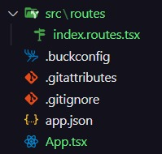
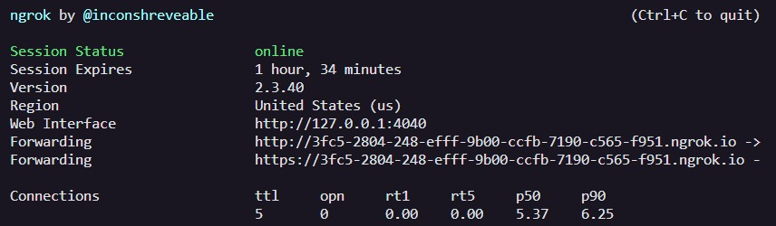

# Expo Bare Features

## O objetivo deste template é ajudar os devs à utilizar algumas funcionalidades comuns no desenvolvimento de aplicativos com React Native / Expo. Nele vamos utilizar:

- Expo Bare Workflow
- TypeScript
- React Navigation
- Native Base
- React Query
- Variáveis de Ambiente (.env)
- Json Server
- Firebase
- Expo Camera
- OTA

### Expo Bare Workflow

Atualmente vejo o Expo Bare Workflow como a melhor forma de criar projetos em React Native, pois conseguimos ter acesso às funcionalidades nativas do dispositivo e ter a facilidade que o expo proporciona.

Tutorial para instalar o expo: [https://docs.expo.dev/get-started/installation/](https://docs.expo.dev/get-started/installation/)

Com o expo já instalado, basta rodar o comando abaixo:

```cmd
npx create-expo-app --template
```

em seguida

```cmd
Escolha a opção "Blank Bare"
```

```cmd
Digite o nome do projeto
```

Como o Bare Workflow não vem com o TypeScript automaticamente, precisamos instalar ele.

### TypeScript

Para iniciar a configuração do TypeScript no nosso projeto, primeiro rodaremos o seguinte comando para criar o arquivo de configuração:

```cmd
touch tsconfig.json
```

Em seguida podemos inicializar o projeto, ele irá instalar automaticamente as dependencias necessárias do TypeScript (Basta apertar **y** quando aparecer a mensagem):

```cmd
npx expo start
```

Caso não seja instalado automaticamente, basta rodar:

```cmd
npx expo install typescript @types/react @types/react-native -D
```

Altere o arquivo:

```cmd
App.js -> App.tsx
```

Para finalizar, rode o comando abaixo para preencher o arquivo **tsconfig.json** com as informações necessárias:

```cmd
npx tsc
```
**ou**
```cmd
yarn tsc
```

Agora seu projeto está pronto para utilizar o Typescript! Caso queira ver a documentação completa, acesse: [https://docs.expo.dev/guides/typescript/](https://docs.expo.dev/guides/typescript/)

### React Navigation

Uma das funcionalidades mais comuns e mais importantes é a navegação entre telas, por isso vamos utilizar o React Navigation. Para iniciar, vamos instalar as seguintes dependências:

```cmd
npm install @react-navigation/native
```
ou
```cmd
yarn add @react-navigation/native
```

```cmd
npx expo install react-native-screens react-native-safe-area-context
```

Agora vamos colocar o Container por volta de toda a aplicação, ele pode ser colocado no index.js ou no App.tsx (eu prefiro colocar no App.tsx):

```tsx
import { NavigationContainer } from "@react-navigation/native";

export default function App() {
  return (
    <NavigationContainer>{/* Rest of your app code */}</NavigationContainer>
  );
}
```

Após isso, vamos configurar o tipo de navegação que vamos utilizar, existem vários tipos (Stack, Drawer, Tabs, etc), vamos utilizar o Stack Navigation.

Instale a dependência:

```cmd
npm install @react-navigation/native-stack
```
ou
```cmd
yarn add @react-navigation/native-stack
```

Antes de configurar a navegação, vamos organizar nosso projeto.

1. Na raiz do projeto, crie uma pasta **src**, onde vai ficar o conteúdo do nosso projeto.

2. Dentro de **src**, crie uma pasta **routes**, e dentro dela crie o arquivo **index.routes.tsx**. Nele vamos colocar o seguinte código:

```tsx
import { createNativeStackNavigator } from "@react-navigation/native-stack";
import { PageExample1 } from "../pages/PageExample1";
import { PageExample2 } from "../pages/PageExample2";

const Stack = createNativeStackNavigator();

export function Routes() {
  return (
    <Stack.Navigator>
      <Stack.Screen name="PageExample1" component={PageExample1} />
      <Stack.Screen name="PageExample2" component={PageExample2} />
    </Stack.Navigator>
  );
}
```

A estrutura de pastas vai ficar assim:



Depois disso, basta adicionar o component Routes no **App.tsx**:
```tsx
import { NavigationContainer } from "@react-navigation/native";
import { Routes } from "./src/routes/index.routes.tsx";

export default function App() {
  return (
    <NavigationContainer>
      <Routes />
    </NavigationContainer>
  );
}
```

Como estamos utilizando o TypeScript, é necessário fazer mais algumas configurações para não ocorrer erro de tipagem. Quando formos criar uma nova tela, precisamos informar quais vão ser a propriedades daquela tela/rota.

Primeiro vamos criar uma pasta **@types**, e dentro dela o arquivo **navigation.d.ts** com o seguinte conteúdo.

```ts
export type PageExample2Params = {
  id: string;
  name: string;
  description: string;
};

export declare global {
  namespace ReactNavigation {
    interface RootParamList {
      pageExample1: undefined;
      pageExample2: GameParams;
    }
  }
}

```

Nesse arquivo, as propriedades padrão do ReactNavigation vão ser sobrescritas, fazendo com que ele entenda as nossas rotas. Nesse exemplo temos duas rotas, a **pageExample1** e **pageExample2** (Precisam ter os mesmos nomes no arquivos index.routes.ts), a primeira rota não recebe parâmetros, já a segunda recebe os parâmetros declarados no início do arquivo.

Pronto! Agora podemos mudar de tela sem problemas.

Documentação completa: [https://reactnavigation.org/docs/hello-react-navigation](https://reactnavigation.org/docs/hello-react-navigation)


Surgiu recentemente uma nova ferramenta de navegação que vale a pena conferir, o **Expo Router**. Lembrando que é uma funcionalidade nova e não deve ser usado em projetos reais ainda. 
Documentação: [https://solito.dev/guides/expo-router](https://solito.dev/guides/expo-router)


### Native Base

Para construir a interface e componentes de forma mais produtiva, vamos utilizar o [Native Base](https://docs.nativebase.io/install-expo)

Vamos iniciar instalando as bibliotecas necessárias:

```cmd
yarn add native-base
```
ou
```cmd
npm install native-base
```

```cmd
expo install react-native-svg
```


Esse próximo já foi instalado, mas caso seja necessário instale novamente:

```cmd
expo install react-native-safe-area-context
```

Com ele instalado, vamos adicionar o Provider por volta de toda a aplicação, assim como fizemos com o React Navigation:

No App.tsx:
```tsx
import { NavigationContainer } from "@react-navigation/native";
import { Routes } from "./src/routes/index.routes.tsx";
import { NativeBaseProvider } from "native-base";

export default function App() {
  return (
    <NativeBaseProvider>
        <NavigationContainer>
            <Routes />
        </NavigationContainer>
    </NativeBaseProvider>
  );
}
```

Agora só usar os componentes disponíveis para ajudar na construção do layout!

Documentação completa: [https://docs.nativebase.io/install-expo](https://docs.nativebase.io/install-expo)

### React Query

O React Query é um biblioteca que melhora a performance e a produtividade quando fazemos requisições à APIs.

Instalação:

```cmd
npm i @tanstack/react-query ou yarn add @tanstack/react-query
```


Podemos fazer toda a configuração no App.tsx, mas vamos organizar melhor isso.

1. Crie uma pasta **services** dentro do **src** e crie o arquivo **queryClient.ts** com o seguinte conteúdo:

```ts
import { QueryClient } from "react-query";

export const queryClient = new QueryClient();
```

2. No **App.tsx** vamos colocar o Provider por volta da aplicação:
```tsx
import { NavigationContainer } from "@react-navigation/native";
import { Routes } from "./src/routes/index.routes.tsx";
import { NativeBaseProvider } from "native-base";
import { queryClient } from "./src/services/queryClient";


export default function App() {
  return (
    <QueryClientProvider client={queryClient}>
      <NativeBaseProvider>
          <NavigationContainer>
              <Routes />
          </NavigationContainer>
      </NativeBaseProvider>
    </QueryClientProvider>
  );
}
```

De configuração é isso! Na pasta **./src/contexts/TodoContext** tem um exemplo de como usar os principais métodos HTTP (GET, POST, PUT, PATCH e DELETE).

Documentação completa: [https://tanstack.com/query/v4/docs/quick-start](https://tanstack.com/query/v4/docs/quick-start)

### Variáveis de ambiente

Uma das configurações mais importantes de qualquer aplicação são as variáveis de ambiente ou secret keys, com o EAS do Expo faremos isso de um jeito diferente, porém muito eficiente e seguro.

Vamos iniciar com a configuração das variáveis no ambiente de desenvolvimento:

Inicie instalando:

```cmd
npm install babel-plugin-inline-dotenv
```
ou
```cmd
yarn add babel-plugin-inline-dotenv
```

Em seguida, no arquivo **.babelrc**, adicione:

```json
{
  "plugins": ["inline-dotenv"]
}
```

Crie um arquivo **environments.ts** na raiz do projeto e configure dessa forma:

```ts
const { CURRENT_ENV } = process.env;
const { DEV_ENV_TEST } = process.env;
const { PROD_ENV_TEST } = process.env;

type EnvsProps = {
  CURRENT_ENV: string;
  ENV_TEST: string;
};

const envs: EnvsProps =
  CURRENT_ENV === "dev"
    ? {
        CURRENT_ENV,
        ENV_TEST: DEV_ENV_TEST,
      }
    : {
        CURRENT_ENV,
        ENV_TEST: PROD_ENV_TEST,
      };

export { envs };
```

Assim as envs vão ficar dinâmicas de acordo com o ambiente, mas para definir o valor das variáveis é preciso:

1. Ter uma conta na [https://expo.dev/](https://expo.dev/)
   
2. Instalar o eas globalmente:

   ```cmd
   npm install -g eas-cli
   ```

3. Logar na sua conta do expo:

   ```cmd
   eas login
   ```

4. Configurar o projeto para utilizar o EAS:

   ```cmd
   eas build:configure
   ```

5. Após rodar o comando anterior, vai ser criado o arquivo **eas.json**, no no nosso projeto vamos utilizar as seguintes configurações:

```json
{
  "cli": {
    "version": ">= 1.2.0"
  },
  "build": {
    "development": {
      "channel": "development",
      "env": {
        "CURRENT_ENV": "dev"
      },
      "android": {
        "buildType": "apk"
      }
    },
    "production": {
      "channel": "production",
      "env": {
        "CURRENT_ENV": "prod"
      },
      "android": {
        "buildType": "apk"
      }
    }
  },
  "submit": {
    "development": {},
    "production": {}
  }
}
```

Para criarmos nossas variáveis de ambiente de produção, o processo é um pouco diferente, precisamos somente rodar o comando abaixo para elas ficarem salvas na conta do Expo como **Secret Keys**:

```cmd
eas secret:create --scope project --name SECRET_NAME --value secretvalue
```

Para verificar as chaves cadastradas:
```cmd
eas secret:list
```
   
Para ver outras configurações, acesse: [https://docs.expo.dev/build/setup/](https://docs.expo.dev/build/setup/)

No arquivo **package.json** vamos criar um script para inicializar o projeto com algumas configurações:

```json
"scripts": {
    "dev": "set CURRENT_ENV=dev&& npx expo start --clear",
    "prod": "set CURRENT_ENV=prod&& npx expo start --clear",
    "android": "expo run:android",
    "ios": "expo run:ios",
    "web": "expo start --web",
    "build:development": "eas build --profile development",
    "build:production": "eas build --profile production"
  },
```

Agora basta rodar o projeto com as configurações que desejar.

### Json Server

O Json Server é uma biblioteca para simular uma API, ela é muito boa quando sua API está sendo feita durante o desenvolvimento da aplicação ou vai ser feita futuramente, essa lib é utilizada apenas para nos ajudar no desenvolvimento.

Instalação:

```cmd
yarn add json-server -D
```
ou
```cmd
npm install json-server --save-dev
```

Crie uma pasta **database** dentro de **src** e crie um arquivo **db.json** com algum conteúdo, simulando um Banco de dados:

```json
{
  "todos": [
    {
      "id": "1",
      "title": "Fazer almoço",
      "done": false
    }
  ]
}
```

No **package.json**, vamos adicionar um novo script:

```json
"api": "json-server --watch ./src/database/db.json -p 3333",
```

Se a gente estivesse utilizando uma aplicação web, já estaria tudo configurado, mas como vamos utilizar nosso celular, precisamos acessar nosso servidor fake de uma forma diferente.

Primeiramente vamos rodar o seguinte comando, aperte **y** para instalar as dependencias necessárias:

```cmd
npx ngrok http 3333
```

Isso vai permitir que acessemos nossa API remotamente. Após rodar o comando, irá aparecer as seguintes informações:



Agora só pegar o link que aparece em **Forwarding** e utilizar ele como o baseUrl

Documentação completa: [https://github.com/typicode/json-server](https://github.com/typicode/json-server)

### Firebase

O Firebase parece ser chatinho de ser implementado, mas vou mostrar que é mais simples do que parece.

A biblioteca que vamos utilizar é o [rnfirebase](https://rnfirebase.io/)

Antes de usar qualquer funcionalidade do Firebase, precisamos fazer as seguintes configurações:

```cmd
npm install --save @react-native-firebase/app
ou
yarn add @react-native-firebase/app
```

Caso não tenha, crie uma conta no [Firebase](https://firebase.google.com/). Se já tiver, entre na sua conta.

Dentro da sua conta:
- Crie um novo projeto.
- Coloque o nome que desejar.
- Ative o Google Analytics se quiser (nesse projeto foi ativado).
- Selecione a conta default.
- Quando o projeto terminar de ser criado, escolha a opção Android:

- No nome do pacote do Android, você deverá colocar o nome igual ao do package no arquivo MainApplication.java (aperte `ctrl + p` para localizar o arquivo).
- Apelido do app pode ser qualquer nome.
- O certificado SHA-1 é opcional, mas será necessário para esse projeto. Para gerar o código, rode o comando abaixo. Será gerado vários cerificados, copie o primeiro do tipo SHA-1.

```cmd
cd android && ./gradlew signingReport
```
- Faça o donwload do arquivo `google-services.json` e coloque em `/android/app`
- Dentro de `/android/build.gradle`, adicione a seguinte linha:
```gradle
buildscript {
      dependencies {
        classpath('com.android.tools.build:gradle:7.1.1')
        classpath('com.facebook.react:react-native-gradle-plugin')
        classpath('de.undercouch:gradle-download-task:5.0.1')
        classpath('com.google.gms:google-services:4.3.14') // <- Adicione essa linha
    }
}
```
- Dentro de `/android/app/build.gradle`, adicione:
```gradle
apply plugin: "com.android.application"
apply plugin: "com.google.gms.google-services" // <- Adicione essa linha
```

Para finalizar a configuração, vamos fazer o autolink do que foi feito:

- Abra o emulador Android.

- Em uma aba do terminal na raiz do projeto, rode:
```cmd
npx react-native start
ou
yarn react-native start
```

- Em outra aba do terminal, rode:
```cmd
npx android
ou
yarn android
```

Esse procedimento vai demorar um pouco na primeira vez. Quando terminar, seu aplicativo abrirá no emulador.

**Aviso!**

Infelizmente o Expo Go não suporta as funcionalidades do Firebase, então a partir de agora será necessário utilizar um emulador ou conectar seu dispositivo Android no computador. O mesmo vale para o IOS.

As funcinalidades específicas são mais facéis de ser implementadas, a documentação delas estão [aqui](https://rnfirebase.io/).

### Expo Camera

Antes de começar, é necessário saber que essa biblioteca não funciona em emuladores, então é preciso rodar o projeto em um dispositivo físico, ou com o Expo Go (mas será necessário comentar todas as importações do Firebase).

Instale a dependência:

```cmd
npx expo install expo-camera
```

No Android, as configurações nativas necessárias serão feitas automaticamente, mas no IOS, devemos adicionar o seguinte trecho de código dentro de `ios/expobarefeatures/Info.plist`:

```xml
	<key>NSCameraUsageDescription</key>
		<string>Allow $(PRODUCT_NAME) to use the camera</string>
		<key>NSMicrophoneUsageDescription</key>
		<string>Allow $(PRODUCT_NAME) to use the microphone</string>
```

Um exemplo bem básico de implementar: 

```tsx
import { Camera, CameraType } from 'expo-camera';
import { useState } from 'react';
import { Button, StyleSheet, Text, TouchableOpacity, View } from 'react-native';

export default function App() {
  const [type, setType] = useState(CameraType.back);
  const [permission, requestPermission] = Camera.useCameraPermissions();

  if (!permission) ... 

  if (!permission.granted) ... 

  function toggleCameraType() {
    setType(current => (current === CameraType.back ? CameraType.front : CameraType.back));
  }

  return (
    <View style={styles.container}>
      <Camera style={styles.camera} type={type}>
        <View style={styles.buttonContainer}>
          <TouchableOpacity style={styles.button} onPress={toggleCameraType}>
            <Text style={styles.text}>Flip Camera</Text>
          </TouchableOpacity>
        </View>
      </Camera>
    </View>
  );
}

```

Além de imagens, também podemos gravar videos, e para visualizar o video, precisamos da biblioteca:

```cmd
npx expo install expo-av
```

No arquivo `android/build.gradle`, adicione:

```gradle
allprojects {
    repositories {
        mavenLocal()
        maven {
            // All of React Native (JS, Obj-C sources, Android binaries) is installed from npm
            url(new File(['node', '--print', "require.resolve('react-native/package.json')"].execute(null, rootDir).text.trim(), '../android'))
        }
        maven {
            // Android JSC is installed from npm
            url(new File(['node', '--print', "require.resolve('jsc-android/package.json')"].execute(null, rootDir).text.trim(), '../dist'))
        }

        // Adicione o bloco de código abaixo
        maven {
            url("$rootDir/../node_modules/expo-camera/android/maven")
        }
```

Dentro de `android/app/src/main/AndroidManifest.xml`, coloque:

```xml
  <!-- Added permissions -->
  <uses-permission android:name="android.permission.CAMERA" />

  <!-- Optional permissions -->
  <uses-permission android:name="android.permission.RECORD_AUDIO" />
```

Pronto! Agora só partir para a implementação. 

Toda a configuração pode ser encontrada na tela `Camera` no projeto.

### OTA

O OTA (Over the air) é uma estratégia muito bacana para atualizar seus apps em produção de maneira fácil, rápida e sem precisar passar pela loja. Com essa ferramenta podemos atualizar diferentes coisas em diferentes ambientes de forma bem simples.

Instale a dependência:

```cmd
npx expo install expo-updates 
```

Caso não tenha feito, crie as configurações do EAS, ele vai ser o responsável por direcionar a atualização do nosso app.
```cmd
eas update:configure 
```

```cmd
eas build:configure
```

No arquivo `eas.json`, adicione os channels de acordo com os seus ambientes:

```json
{
  "build": {
    "preview": {
      "channel": "preview"
      // ...
    },
    "production": {
      "channel": "production"
      // ...
    }
  }
}
```

Depois disso, alguns arquivos nativos serão configurados, se tiver algum problema quanto a isso, verfique a documentação do [Updating Bare App](https://docs.expo.dev/bare/updating-your-app/).

No `App.tsx`, coloque o trecho de código abaixo antes do **return**:

```tsx
  async function updateApp() {
    // Verifica se tem alguma atualização disponível
    const { isAvailable } = await Updates.checkForUpdateAsync();

    if (isAvailable) {
      // Baixa a atualização
      await Updates.fetchUpdateAsync();
      // Reinicia o app para que as atualizações funcionem
      await Updates.reloadAsync();
    }
  }

  useEffect(() => {
    updateApp();
  }, []);
```


Pronto! Vamos criar um script no `package.json` para atualizar nosso app.

```json
    "publish:production": "eas update --branch production"
```

Viu como é fácil?! Agora sempre que você fizer uma atualização, basta rodar esse comando e tudo será atualizado de forma automática e sem passar pela loja!

**Aviso!**
As atualizações nativas **não** funcionam com o OTA, ou seja, se for preciso mexer nas pastas android ou ios, será necessário gerar um novo apk. Fora isso, tudo pode ser atualizado!